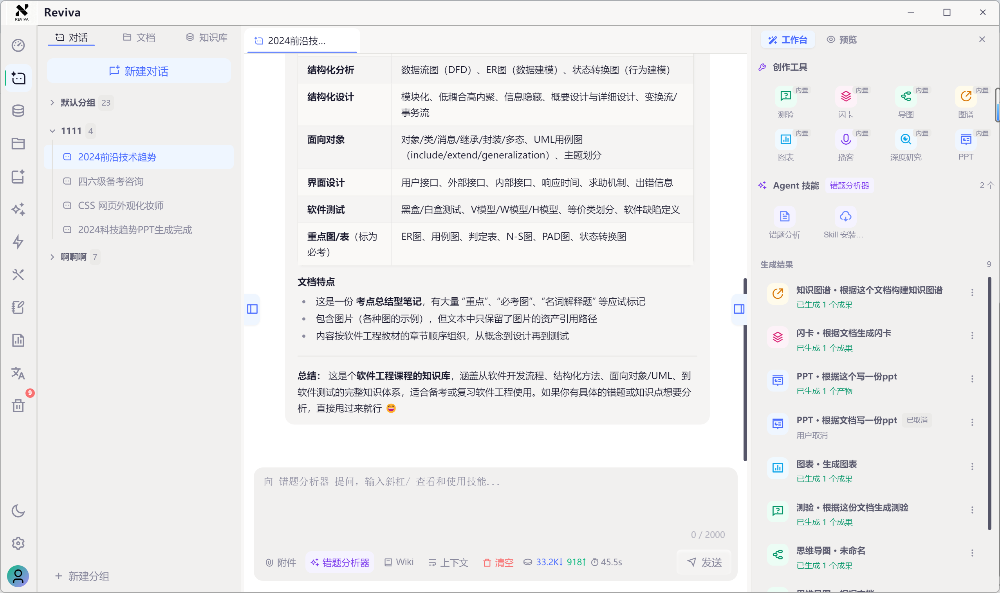
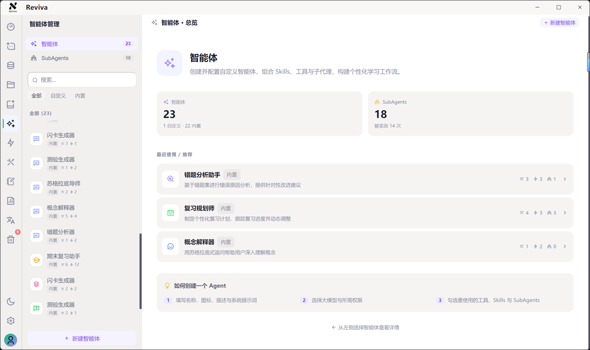
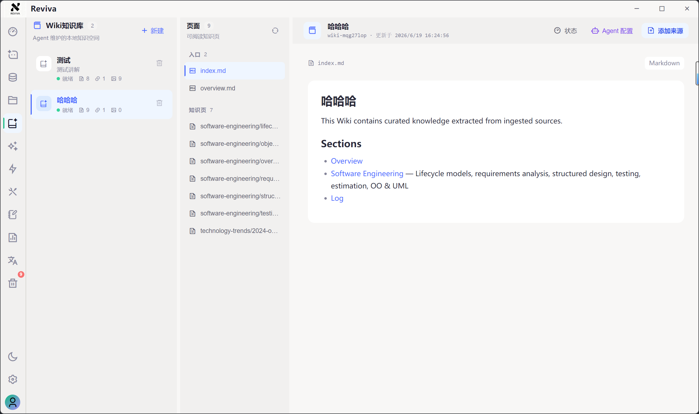
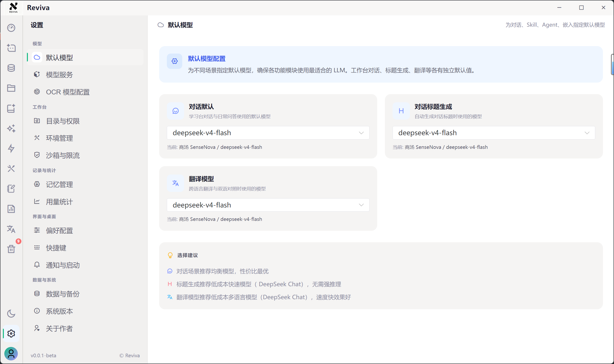
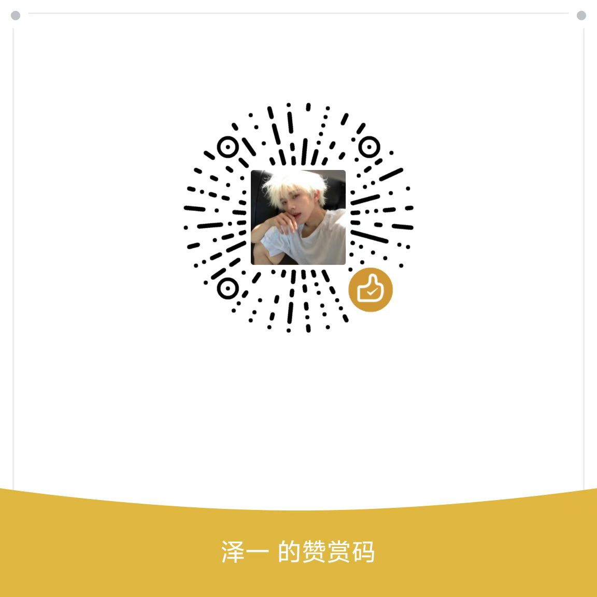

# Reviva

**AI 学习工作台，围绕你的资料完成问答、笔记、复习和创作输出。**

桌面端 · 资料问答 · 创作工作台

  中文
  ·
  <a href="./README_EN.md">English</a>

  
  

  

  
  
  
  
  
  

  <a href="#下载与安装">下载安装</a>
  ·
  <a href="#核心特点">核心功能</a>
  ·
  <a href="#典型使用场景">使用场景</a>
  ·
  <a href="#开源协议与商业授权">开源协议</a>
  ·
  <a href="#联系与交流">联系交流</a>

Reviva = 本地资料库 + Wiki 知识库 + AI Agent + 知识库检索 + 笔记文档管理 + Skills 能力系统 + 创作工具。

它适合希望把 AI 真正接入学习和知识管理流程的人——不是每次都从一个空白聊天框重新开始。

## 下载与安装

普通用户推荐直接下载已经打包好的安装包，不需要自行配置开发环境。

| 渠道 | 下载地址 | 说明 |
| --- | --- | --- |
| GitHub Releases | [Github Release]( https://github.com/mingchen666/Reviva/releases)  | 推荐优先使用，便于查看版本更新 |
| 百度网盘 | [点击下载](https://pan.quark.cn/s/9cbc820db4ef#/list/share) | 国内网络备用下载 |
| 夸克网盘 | [点击下载](https://pan.quark.cn/s/9cbc820db4ef#/list/share) | 国内网络备用下载 |

当前主要面向 Windows 桌面端使用，后续会支持 macOS / Linux 打包。

## 界面演示

<table>
  <tr>
    <td align="center"><b>学习台</b> — 与 Agent 对话、引用资料、触发创作</td>
    <td align="center"><b>智能体</b> — 独立角色、模型、Skills、工具</td>
  </tr>
  <tr>
    <td></td>
    <td></td>
  </tr>
  <tr>
    <td align="center"><b>Wiki知识库</b> — Wiki 检索、资料沉淀</td>
    <td align="center"><b>设置中心</b> — 模型配置、记忆管理、消耗统计、偏好设置</td>
  </tr>
  <tr>
    <td></td>
    <td></td>
  </tr>
</table>

## 为什么做 Reviva

市面上大多数 AI 工具就是一个聊天框，每次都得从零开始。但真实的学习和研究不是这样——资料会越积越多，笔记需要持续沉淀，问题经常跨文档跳转，不同任务还得用不同角色的 AI。

Reviva 把这些环节拢到一个桌面环境里：资料进来建知识库，Agent 基于你的资料回答问题，笔记和输出能沉淀下来下次接着用，创作工具还能围绕资料直接生成导图、闪卡、测验、PPT 和深度研究报告。不是每次打开都是空白对话，而是让 AI 真正参与你的完整学习流程。

## 项目状态

当前版本 `0.0.1-beta`，功能与界面仍在快速迭代。主要面向 Windows 桌面端，macOS / Linux 未来支持。数据本地优先（SQLite + 授权工作目录），AI 支持多模型服务商、OpenAI-compatible、自定义 Agent。

本项目主要通过 Vibe Coding 方式开发，前后耗时两个多月。可能存在一些 bug，欢迎通过 [GitHub Issues](https://github.com/mingchen666/Reviva/issues) 反馈。

正式用于长期资料管理前，请做好重要数据备份。

大多数 AI 工具只提供一个聊天入口，但真实学习和研究工作不是一次性问答，而是持续发生的：

- 资料会不断增加
- 笔记会不断沉淀
- 问题会在不同文档之间来回跳转
- 同一个任务需要不同角色的 AI 协作
- 输出结果需要被保存、整理、复用

Reviva 的目标是把这些环节放在同一个桌面环境中，让 AI 不只是回答问题，而是参与完整的学习和知识工作流。

## 核心特点

### 本地优先，数据可控

Reviva 的笔记、对话、文档、Agent 配置、Skills 配置等数据主要保存在本地磁盘和本地 SQLite 数据库中。你可以自行备份、迁移和管理，不必把所有资料绑定到某个云平台。

本地优先并不代表不能联网。你可以选择云端模型、本地模型或自建 OpenAI-compatible 服务。AI 是否联网，取决于你配置的模型和工具。

### AI Agent，不只是聊天

Reviva 支持创建多个专属 AI Agent。每个 Agent 都可以有自己的：

- 系统提示词
- 默认模型
- Skills 能力模块
- 工具绑定
- 知识库配置
- 运行限制
- 审查模型
- 输出风格

你可以为不同任务创建不同 Agent，例如：

- 论文阅读助手
- 考研复习教练
- 英语学习搭子
- 编程学习助手
- 产品研究分析师
- 文档总结助手
- PPT / 研究报告生成助手

### Skills 能力模块

Skills 是可以绑定到 Agent 的能力模块，用于增强 Agent 在特定领域的表现。它可以理解为一组可复用的专业提示词、规则、模板和参考资料。

### Wiki 知识库与资料检索

Reviva 支持创建 Wiki 风格的知识库，将本地资料、学习主题、项目文档和长期积累的内容整理成可检索、可沉淀、可持续扩展的知识集合。Agent 可以基于知识库内容进行问答、总结和分析，减少纯模型幻觉，让回答更贴近你的真实资料。

知识库适合用于：

- 课程资料管理
- 论文资料库
- 期末复习资料库
- 考研 / 考证资料库
- 项目知识库
- 个人阅读库

### 学习台

学习台是 Reviva 的主要工作区。你可以在这里和 Agent 对话、引用资料、调用工具、触发创作任务，并将输出沉淀到笔记、文档或输出中心。

### 创作工作台

Reviva 不只做问答，也支持围绕资料生成结构化成果。生成结果会进入输出中心，方便后续查看、整理和复用。

当前支持的创作类型：

- 测验 · 闪卡 · 思维导图 · 知识图谱 · 图表 — 本地生成
- 深度研究 · PPT — 支持本地和云端生成（云端按量付费）
- 播客 — 云端生成（按量付费）

### 工具系统与 MCP

Reviva 的 Agent 可以绑定工具，让 AI 参与更真实的任务流程。支持内置工具、自定义工具和 MCP 远程工具服务，进一步扩展 Agent 的能力边界。

### 多模型服务商

Reviva 支持多种模型服务商和 OpenAI-compatible 接口。你可以根据成本、速度、隐私和能力需求自由配置。

## 产品模块

| 模块 | 说明 |
| --- | --- |
| 仪表盘 | 查看最近活动、快捷入口和任务状态 |
| 学习工作台 | 与 Agent 对话，引用资料，触发创作任务 |
| 智能体 | 创建、编辑和管理 AI Agent |
| Skills | 管理内置和自定义能力模块 |
| 工具 | 管理内置工具、自定义工具和 MCP 服务 |
| 知识库 / Wiki | 管理系统知识库和用户知识库，沉淀课程、论文、项目和复习资料 |
| 文档 | 管理本地资料和文件夹 |
| 笔记 | Markdown 笔记与目录管理 |
| 任务 | 跟踪生成任务和学习任务 |
| 输出中心 | 管理 Agent 生成的成果 |
| 回收站 | 统一恢复或永久删除文档、笔记、对话等内容 |
| 设置 | 模型、外观、数据、环境、用量统计等配置 |

## 典型使用场景

### 课程学习

1. 导入课件、教材摘录、习题和自己的笔记。
2. 建立课程知识库。
3. 使用学习教练 Agent 进行问答。
4. 生成闪卡、测验题、复习计划。
5. 在仪表盘和任务模块跟踪学习进度。

### 期末复习

1. 按课程建立 Wiki 知识库，例如"数据结构期末复习""概率论复习资料"。
2. 导入课件、老师划重点、历年题、错题、课堂笔记和教材章节。
3. 让 Agent 根据资料整理章节大纲、重点概念、公式清单和高频考点。
4. 针对薄弱章节生成测验题、闪卡和错题回顾。
5. 复习结束后把总结沉淀为笔记，下一轮复习可以继续检索和追问。

### 个人第二大脑

1. 把长期阅读、写作、学习资料持续沉淀到 Reviva。
2. 用不同 Agent 负责不同领域。
3. 通过知识库检索和笔记系统复用历史理解。
4. 将 AI 输出整理成自己的知识资产。

## 使用流程

1. 下载并安装 Reviva。
2. 首次启动时选择本地工作目录。
3. 在设置中配置模型服务商。
4. 导入文档、笔记或学习资料。
5. 创建知识库并添加资料。
6. 创建或选择 Agent，绑定 Skills、工具和知识库。
7. 在学习台进行问答、分析和创作。
8. 将输出沉淀到笔记、文档或输出中心。

## 数据与隐私

- 本地数据默认保存在用户选择的工作目录和本地数据库中。
- 文档、笔记、对话、Agent、Skills 等数据可以自行备份和迁移。
- 文件读写受授权根目录限制，降低误访问系统敏感路径的风险。
- AI 请求是否发送到云端，取决于你配置的模型服务商。
- 使用云端模型、搜索工具或远程 MCP 服务时，请自行确认对应服务商的数据政策。

## 开源协议与商业授权

本项目采用 **AGPL-3.0 + 商业许可** 双授权模式。

### 个人用户

- **个人学习、研究和自用永久免费**，无需付费或申请授权。
- 你可以在 AGPL-3.0 协议下自由使用、修改和自部署 Reviva。
- 修改后的版本如通过网络提供服务，需按 AGPL-3.0 要求开放源码。

### 商业与多人使用

以下场景需要提前联系作者获取商业授权：

- 企业、机构、团队内部多人使用
- 商业化产品或收费服务中集成 Reviva
- 二次开发后用于客户项目、培训交付或商业解决方案
- 作为闭源产品、SaaS 服务或私有化部署的一部分
- 二次分发、白标包装或嵌入其他商业软件
- 移除、隐藏或修改 Reviva 的版权和授权声明

如果你不确定自己的使用场景是否需要授权，请先联系作者确认。

## 未来计划

- [ ] 自定义skill
- [ ] 更丰富的内置 Agent 和 Skills
- [ ] 更完善的导入导出与备份能力
- [ ] Agent 记忆与长期学习能力
- [ ] Agent 自主学习成长闭环（长期积累用户偏好、学习画像、薄弱点，所有成长结果可审计、可撤销、可评测）
- [ ] 更多......

## 免责声明

AI 生成内容可能存在错误、遗漏或不适合直接使用的情况。请在学习、研究、商业、法律、医疗等重要场景中自行核验。Reviva 不对模型输出的准确性、完整性或适用性作保证。

## 联系与交流

- 问题反馈：[GitHub Issues](https://github.com/mingchen666/Reviva/issues)
- 商业授权与合作：见下方微信
- 项目主页：[GitHub](https://github.com/mingchen666/Reviva)

<table>
  <tr>
    <td align="center"><b>微信联系</b></td>
    <td align="center"><b>用户交流群</b></td>
  </tr>
  <tr>
    <td align="center"></td>
    <td align="center"></td>
  </tr>
</table>

## 赞赏支持

Reviva 的开发消耗了大量心血，如果觉得好用，欢迎请作者喝杯咖啡：

## 其他项目

- [DocTranslator](https://github.com/mingchen666/DocTranslator) — AI 驱动的文档翻译平台

## 致谢

- [Vue.js](https://vuejs.org/) · [Electron](https://www.electronjs.org/) · [Vite](https://vitejs.dev/)
- [DeepAgents](https://github.com/langchain-ai/deepagentsjs)
- [OfficeCLI](https://github.com/iOfficeAI/OfficeCLI)
- [Linux Do](https://linux.do/)

感谢所有开源贡献者和社区用户。
