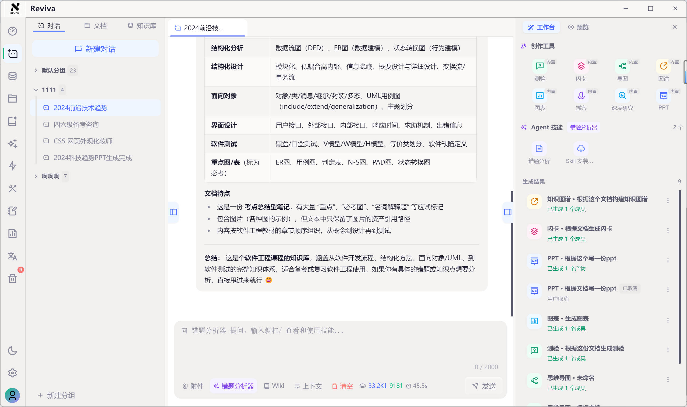
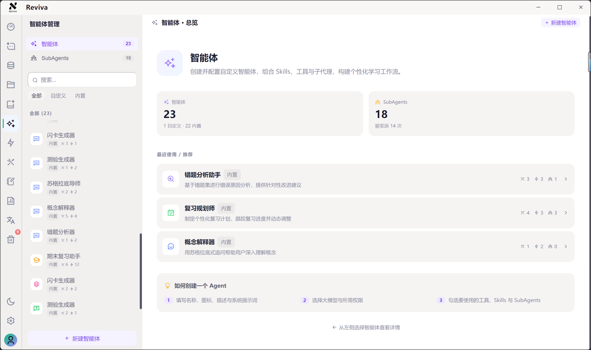
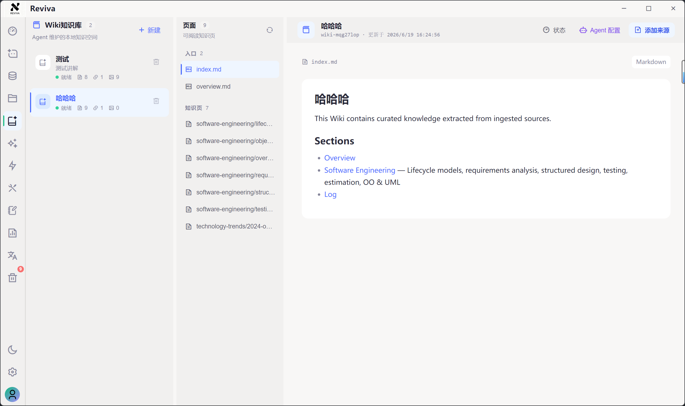
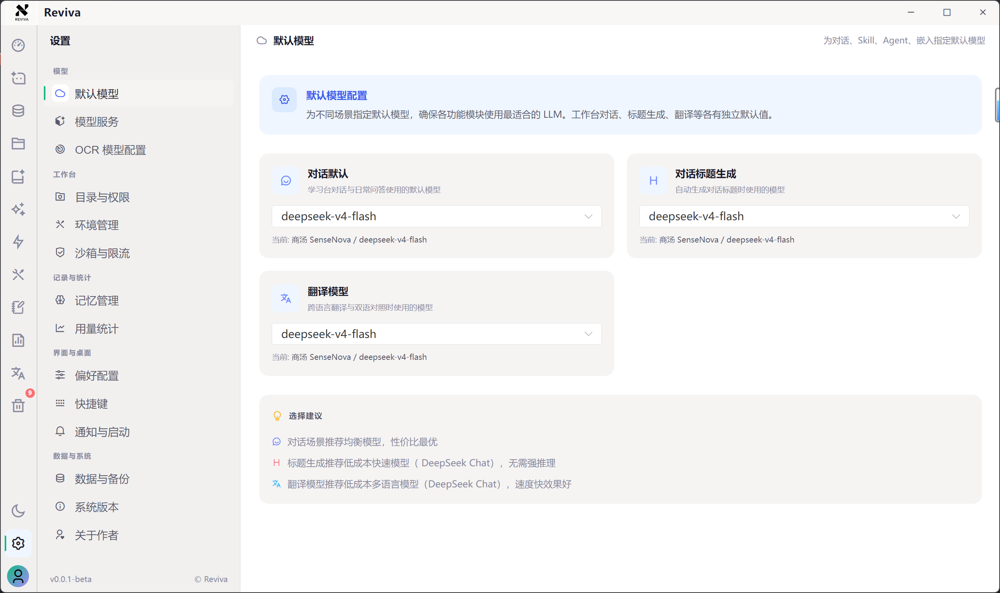
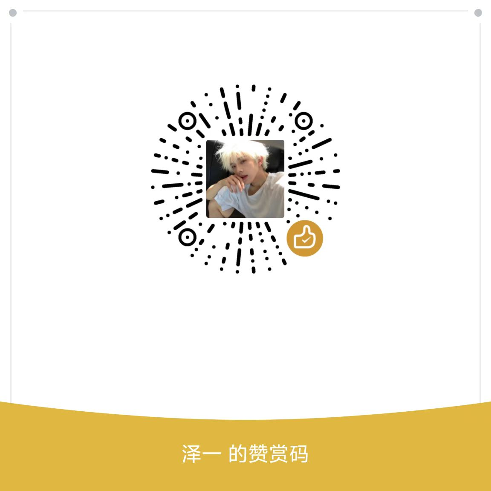

# Reviva

**AI learning workspace for Q&A, notes, review, and creative output around your own materials.**

Desktop · Local-First · AI Agent · Learning Toolkit

  <a href="./README.md">中文</a>
  ·
  English

  
  
  

  
  
  
  
  

  <a href="#download-and-installation">Download</a>
  ·
  <a href="#core-capabilities">Core Capabilities</a>
  ·
  <a href="#learning-loop">Learning Loop</a>
  ·
  <a href="#use-cases">Use Cases</a>
  ·
  <a href="#license-and-commercial-use">License</a>
  ·
  <a href="#contact-and-community">Community</a>

Reviva is a local desktop Agent for learning, research, and knowledge work. It brings conversations, documents, knowledge bases, notes, review tools, and creative outputs into one workspace.

It is not just a chat window with a pile of tools. Reviva is a **local learning workspace centered on Agents**: Agents understand your materials, call tools, use Skills, follow permissions, and turn results into reusable learning artifacts.

Reviva = local document library + Wiki knowledge base + AI Agent + knowledge retrieval + note and document management + Skills system + creation tools.

It is for anyone who wants AI to become part of a real learning and knowledge workflow, instead of starting from a blank chat every time.

<table width="100%">
  <tr>
    <td align="center">
      <h2>🎉 Reviva 1.0.0 Official Release</h2>
      
<b>The first stable release is now available.</b>

      
Use an Agent-centered workspace to connect local materials, knowledge bases, notes, and learning tools from understanding and review to creative output.

      
<b>Agent-driven · Local-first · Multi-source chat · Visual learning · Continuous knowledge capture</b>

      

        
        
        
      

    </td>
  </tr>
</table>

## Download and Installation

Download the latest installer directly. Users in mainland China can use the Quark Netdisk mirror.

| Channel | Link | Notes |
| --- | --- | --- |
| GitHub Releases | [Download the latest version](https://github.com/mingchen666/Reviva/releases) | Official release channel and version notes |
| Quark Netdisk | [Open download](https://pan.quark.cn/s/9cbc820db4ef#/list/share) | Mirror for mainland China |

Installers are currently available for Windows and macOS. Choose the correct system and CPU architecture before downloading, and back up important data before upgrading.

## Interface Demo

The screenshots below show the main work areas in the current desktop version:

<table>
  <tr>
    <td align="center"><b>Learning Workspace</b> Chat with Agents, reference materials, and call learning tools</td>
    <td align="center"><b>Agents</b> Create roles and bind models, Skills, tools, and knowledge bases</td>
  </tr>
  <tr>
    <td></td>
    <td></td>
  </tr>
  <tr>
    <td align="center"><b>Wiki Knowledge Base</b> Turn materials into searchable, traceable knowledge</td>
    <td align="center"><b>Settings</b> Configure models, memory, permissions, environment, themes, and usage</td>
  </tr>
  <tr>
    <td></td>
    <td></td>
  </tr>
</table>

## Why Reviva

Most AI tools start from a blank chat box, while real learning keeps accumulating materials, notes, questions, and review results. Reviva keeps these pieces in one local workspace:

- 📚 Import, parse, retrieve, and continuously maintain your materials
- 💬 Group and branch conversations while preserving context and sources
- 🧠 Switch Agents in the same conversation and share context
- ✨ Turn one source into quizzes, flashcards, mind maps, charts, PPTs, podcasts, or research reports
- 🔁 Save outputs to notes, Wiki pages, and local folders to build a learning loop

## Who Is It For

- 🎓 **Students and exam candidates**: organize course materials, handouts, and mistakes into quizzes, flashcards, mind maps, and review content.
- 💼 **Knowledge workers**: analyze, edit, present, and organize project materials, meeting notes, and Office documents.
- 🧠 **Personal knowledge managers**: use different Agents to manage long-term materials, notes, memory, and Wiki pages as a continuously growing second brain.

## Core Capabilities

| Core capability | What you can do |
| --- | --- |
| 🤖 **Multi-Agent collaboration** | Switch Agents in a conversation; Agents share context and use global Agent memory to retain long-term preferences |
| 📚 **Material-grounded chat** | Select local documents, entire folders, or Wiki knowledge bases as context; use `@` quick input and `/` commands to call content and Skills |
| 🎬 **Audio and video learning** | Parse audio and video, transcribe speech, extract keyframes, and ask questions about selected media in the conversation |
| 🧩 **Visual learning and creation** | Generate quizzes, flashcards, mind maps, knowledge graphs, charts, PPTs, podcasts, and deep research reports, then view the results visually |
| 🗂️ **Continuous knowledge capture** | Upload materials, let an Agent maintain Wiki knowledge, and feed conversation results back into notes, documents, and future learning |
| 🔐 **Custom models and data control** | Connect your own API keys, OpenAI-compatible services, cloud models, or local models; configure Agents, token usage, permissions, and backups |

### Agent-Driven Workflow

1. **Choose a role**: switch between built-in or custom Agents in the same learning workspace, such as a course tutor, review coach, or document assistant.
2. **Share context**: Agents can access selected documents, folders, knowledge bases, notes, and tools, so switching roles does not require selecting everything again.
3. **Call capabilities**: Agents can use Skills, file tools, Office document operations, knowledge retrieval, OCR, media parsing, and visualization tools as needed.
4. **Control execution**: command execution, file writes, external requests, and MCP tools are governed by permissions, request limits, and the security sandbox.
5. **Capture results**: conversations, document queries, visual results, and learning artifacts can be saved locally and reused through notes, Wiki pages, tasks, and global Agent memory.

## Learning Loop

1. **Import materials**: upload Office files, PDFs, Markdown, images, audio, or video, or import content from a URL.
2. **Choose an Agent and context**: select the Agent for the task and choose documents, folders, or knowledge bases; multiple Agents can share the same materials, notes, and tools.
3. **Understand and ask**: ask for Q&A, summaries, comparisons, explanations, rewrites, or deep research; create conversation branches when you want to preserve different directions.
4. **Generate learning artifacts**: turn materials into quizzes, flashcards, mind maps, knowledge graphs, charts, PPTs, podcasts, and other usable outputs.
5. **Capture and reuse**: save important results as notes, documents, or Wiki pages, then retrieve, review, and continue asking questions later.

### A Complete Example

Imagine you have a recorded lecture and its course handouts:

1. Import the video and handouts, then run speech transcription, keyframe extraction, and document parsing.
2. Select a course tutor Agent to explain key concepts using both the video and handouts.
3. Switch to a review coach Agent, share the existing context, and generate quizzes, flashcards, and a mind map.
4. Save mistake explanations and chapter summaries to notes, then let the Agent maintain the course Wiki.
5. During the next review session, search the knowledge base, revisit the conversation, and focus on weak concepts.

## Agent Workspace Complete Feature Set

### 💬 Conversations and Context

- Conversation groups, history, message export, and conversation branches
- Select local documents, folders, knowledge bases, or the current workspace as context
- Switch Agents in the learning workspace while keeping reusable material context
- Use `@` quick input and `/` slash commands to call Skills
- Streaming responses, task status, conversation task notifications, and background progress
- Query documents directly from Agent output, open source references, and preview HTML, charts, and other visual artifacts

### 🎓 Visual Learning and Content Creation

Reviva does more than produce text. The learning workspace can turn the current conversation, selected documents, knowledge bases, or a custom topic into artifacts that are easy to practice, browse, and present:

| Tool | What it is for |
| --- | --- |
| Quiz | Generate multiple-choice, true/false, fill-in-the-blank, and short-answer questions to find weak areas |
| Flashcards | Break concepts, formulas, vocabulary, and mistakes into reviewable memory cards |
| Mind map | Organize a chapter, course, or project into a hierarchy |
| Knowledge graph | Show relationships between concepts, people, events, and knowledge points |
| Charts | Generate flowcharts, comparisons, matrices, and other visual results |
| PPT | Create presentation decks from materials, knowledge bases, or research results |
| Podcast | Rewrite long documents and course materials into listenable podcast scripts and audio |
| Deep research | Break down questions, collect evidence, and produce structured research reports |

Local generation is suitable for fast study and organization. PPT, deep research, and some cloud creation capabilities may require cloud models or pay-as-you-go services.

### 📄 Documents, Office, and OCR

- Support common formats including Office, PDF, Markdown, CSV, JSON, and images
- Upload files, batch import, manage folders, and import from URLs
- Agents can read, summarize, proofread, edit, and create Office documents
- Choose local parsing or a configured document parsing service when importing materials
- Configure OCR models for PDF and image text recognition
- URL import supports web crawling, main-content extraction, and document parsing
- Preview documents and outputs, soft-delete content, and restore it from the Recycle Bin

### 🎬 Audio and Video Parsing with Chat

- Import common audio and video files and manage them in the Documents module
- Parse media and transcribe speech into searchable, referenceable text
- Extract video keyframes to help understand lectures, presentations, interviews, and course recordings
- View parsing details, transcripts, timestamps, and keyframe results
- Select parsed audio or video in a conversation and ask an Agent to summarize, explain, or tutor you on the material
- Configure speech recognition models; speech synthesis is coming soon

### 🤖 Agents and Extensions

- Built-in Agents such as quiz generation assistants, learning coaches, and final-exam review assistants
- Create and manage custom Agents
- Multiple Agents can share knowledge bases, documents, notes, and tool context
- Configure prompts, models, Skills, tools, knowledge bases, and output styles for each Agent
- Built-in tools for file reading, writing, web search, and knowledge-base queries
- Custom tools and HTTP/SSE MCP services
- Agent runtime permissions, command execution permissions, request limits, and security sandbox controls
- Global Agent memory for personal preferences, long-term context, and reusable rules across Agents and conversations

### 🗂️ Knowledge Capture

- Create multiple Wiki knowledge bases for courses, papers, projects, or topics
- Let an Agent organize and maintain Wiki pages after you upload and select documents
- Source tracing, knowledge retrieval, and material-grounded Q&A
- Markdown notes with folders, search, preview, and AI-assisted editing

### ⚙️ System and Data

- Light and dark themes, custom theme colors, and Agent tone settings
- Configure your own LLM models, including API keys, OpenAI-compatible services, and local models
- Visualize token usage, model calls, and task status
- Global shortcuts, task notifications, and automatic update checks
- Detect runtime dependencies such as Pandoc, Manim, FFmpeg, and OfficeCLI for optional installation
- Three backup modes: full data backup, compact backup, and database backup
- Unified Recycle Bin for restoring or permanently deleting documents, notes, conversations, and more
- Local gateway service exposing Agent capabilities through OpenAI Chat Completions and Responses API formats

## Product Modules

| Module | Description |
| --- | --- |
| Dashboard | Recent activity, quick entries, and task status |
| Learning Workspace | Chat with Agents, reference materials, switch Agents, and trigger learning tools and creation tasks |
| Agents | Create, edit, and manage built-in or custom Agents |
| Skills | Manage built-in and custom capability modules that can be bound to Agents |
| Tools | Manage built-in tools, custom tools, and MCP services |
| Knowledge Base / Wiki | Manage knowledge bases for courses, papers, projects, and review materials |
| Documents | Manage local materials, folders, Office documents, and media files |
| Notes | Create and manage Markdown notes and folders |
| Tasks | Track generation tasks, media parsing tasks, and learning tasks |
| Output Center | Manage Agent-generated documents, queries, and visual artifacts |
| Recycle Bin | Restore or permanently delete documents, notes, conversations, and more |
| Settings | Configure models, speech, OCR, appearance, permissions, data, environment, and usage |

## Use Cases

### Final Exam Review

1. Create a Wiki knowledge base for each course, such as "Data Structures Final Review" or "Probability Theory Review".
2. Import slides, teacher highlights, past papers, mistakes, class notes, and textbook chapters.
3. Ask an Agent to organize chapter outlines, key concepts, formula lists, and high-frequency exam topics.
4. Generate quizzes, flashcards, and mistake reviews for weak topics.

### Course Learning

1. Import slides, textbooks, exercises, and class notes.
2. Create a course Wiki and choose a learning coach Agent.
3. Ask questions around each chapter and let the Agent explain difficult points with sources.
4. Generate quizzes and flashcards, then return to the conversation to ask follow-up questions.

### Audio and Video Learning

1. Import a lecture recording, interview, or talk.
2. Transcribe it and extract keyframes to locate important moments.
3. Ask questions about a specific section in the conversation and request a summary or explanation.
4. Turn the material into notes, flashcards, quizzes, or a podcast script.

### Personal Second Brain

1. Keep reading, work, and study materials in the local workspace.
2. Use different Agents for writing, programming, translation, review, and research.
3. Capture valuable conclusions in notes and Wiki knowledge bases.
4. Retrieve and reuse your previous understanding when similar questions come up.

## Quick Start

1. Download and install Reviva from the channels above.
2. Choose a local workspace and authorized root directory on first launch.
3. Configure an LLM provider, API key, or local model in Settings.
4. Import a document or create a knowledge base.
5. Open the Learning Workspace, choose an Agent and materials, and ask your first question.
6. Try `/` to call the quiz, flashcard, or mind-map tools, then save the result to Notes or Wiki.

For detailed installation, environment, and feature documentation, see the documentation site source in `docs/src/views/docs-site`.

## Local-First and Privacy

- Conversations, documents, notes, knowledge bases, Agent configurations, and task records are primarily stored in the local workspace and SQLite database.
- File tools access files through the authorized root directory and virtual file system to reduce accidental access to sensitive system paths.
- You can migrate, back up, or delete your local data without being tied to a cloud platform.
- Whether AI requests are sent to the cloud depends on the model, OCR, speech, and retrieval services you configure.
- Review the data policies and pricing of cloud models, search tools, and remote MCP services before using them.

## Project Status

Reviva's current official version is `1.0.0`. Features and UI continue to evolve. The project currently targets Windows and macOS desktop users; back up important data before long-term use.

For issues, please open a [GitHub Issue](https://github.com/mingchen666/Reviva/issues).

## Roadmap

- [x] Automatic update checks
- [x] URL import and crawling
- [x] Audio and video parsing
- [x] Wiki links and audio/video parsing
- [x] Responses API format
- [x] Custom Skills
- [ ] More built-in Agents and Skills
- [x] Improved import, export, and backup capabilities
- [x] Agent autonomous learning growth loop (accumulate user preferences, learning profiles, and weak points over time; keep all growth results auditable, reversible, and evaluable)(beta)
- [ ] More...

## License and Commercial Use

This project uses an **AGPL-3.0 + Commercial License** dual-licensing model.

### Personal Users

- Personal learning, research, and self-use are permanently free; no payment or authorization is required.
- You may freely use, modify, and self-deploy Reviva under AGPL-3.0.
- Modified versions served over a network must disclose their source code under AGPL-3.0.

### Commercial and Multi-User Use

The following scenarios require prior commercial authorization from the author:

- Internal multi-user use by an enterprise, organization, or team
- Integration into a commercial product or paid service
- Secondary development for client projects, training delivery, or commercial solutions
- Use as part of a closed-source product, SaaS service, or private deployment
- Redistribution, white-label packaging, or embedding into another commercial software product
- Removing, hiding, or modifying Reviva copyright or license notices

## Disclaimer

AI-generated content may contain errors, omissions, or content unsuitable for direct use. Verify important outputs yourself in learning, research, commercial, legal, medical, and other high-stakes contexts. Reviva does not guarantee the accuracy, completeness, or applicability of model outputs.

## Contact and Community

- Bug reports: [GitHub Issues](https://github.com/mingchen666/Reviva/issues)
- Project homepage: [GitHub](https://github.com/mingchen666/Reviva)
- Collaboration and community: use the contact options below

<table>
  <tr>
    <td align="center"><b>Contact the Author</b></td>
    <td align="center"><b>Community Group</b></td>
  </tr>
  <tr>
    <td align="center"></td>
    <td align="center"></td>
  </tr>
</table>

## Sponsor

Reviva requires continuous development effort. If it helps with your learning or work, consider buying the author a coffee:

## Other Projects by the Author

- [DocTranslator](https://github.com/mingchen666/DocTranslator) — AI-powered document translation platform

## Acknowledgments

- [Vue.js](https://vuejs.org/) · [Electron](https://www.electronjs.org/) · [Vite](https://vitejs.dev/)
- [DeepAgents](https://github.com/langchain-ai/deepagentsjs)
- [OfficeCLI](https://github.com/iOfficeAI/OfficeCLI)
- [Linux Do](https://linux.do/)

Thanks to all open-source contributors and community users.
